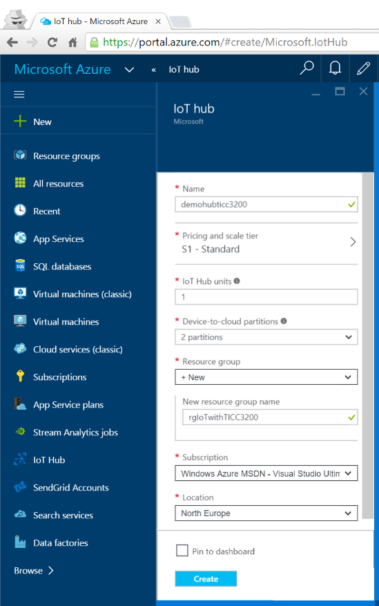
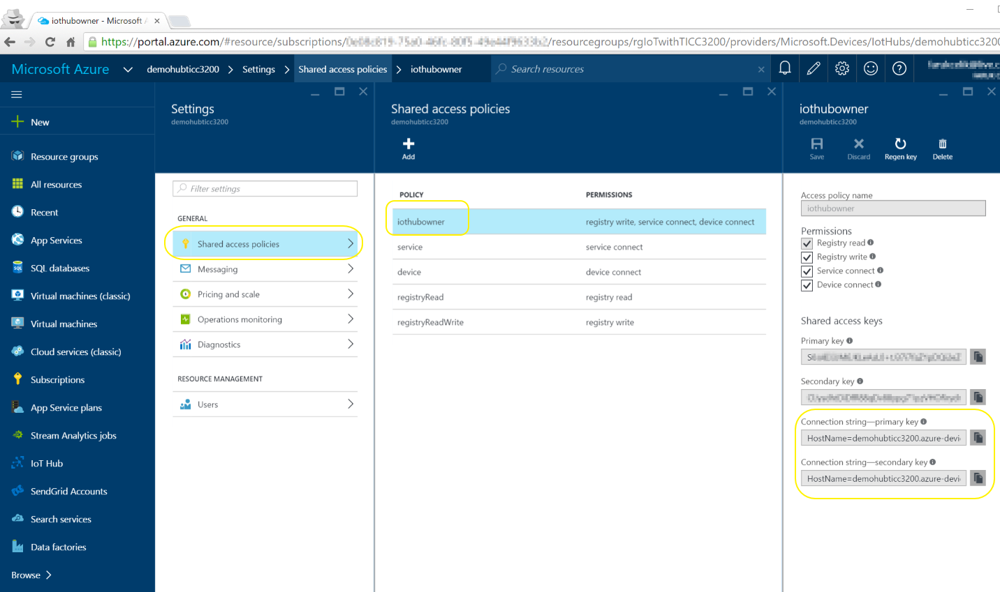
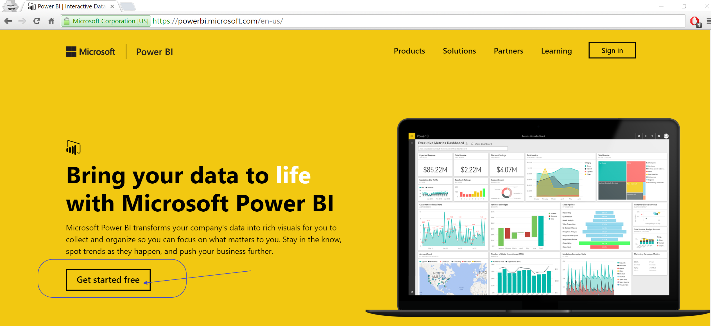
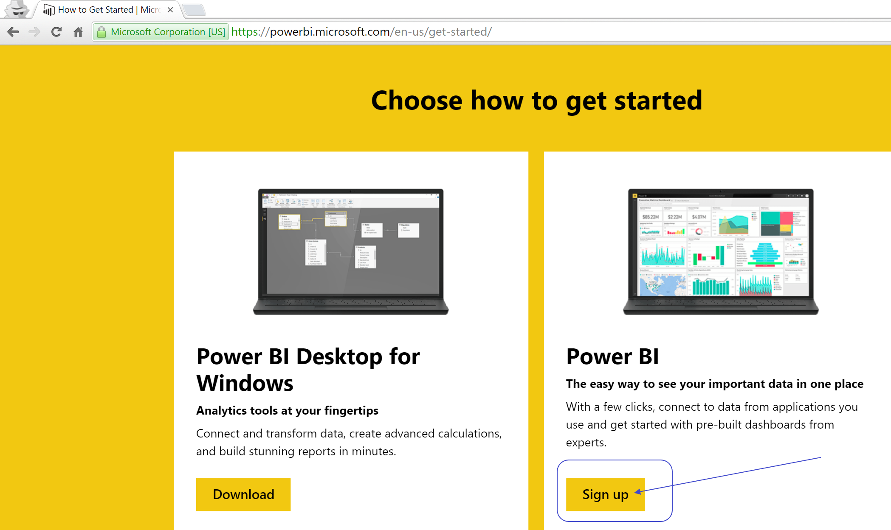
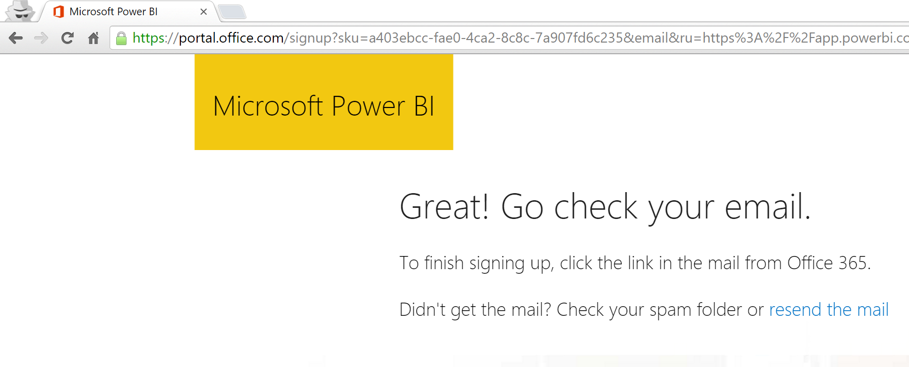
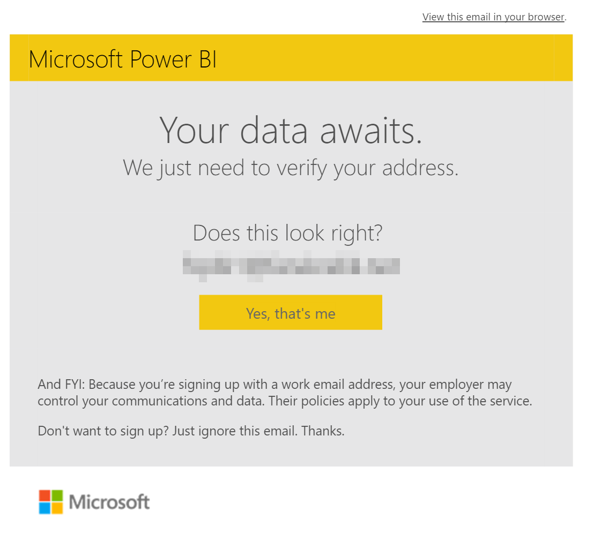
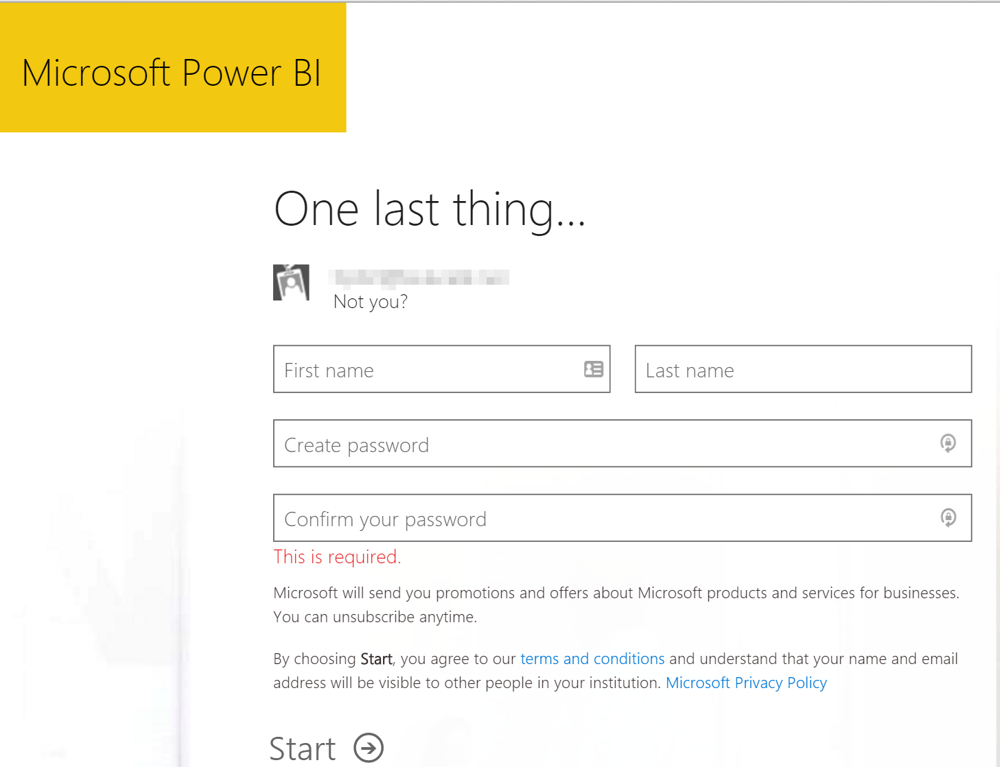
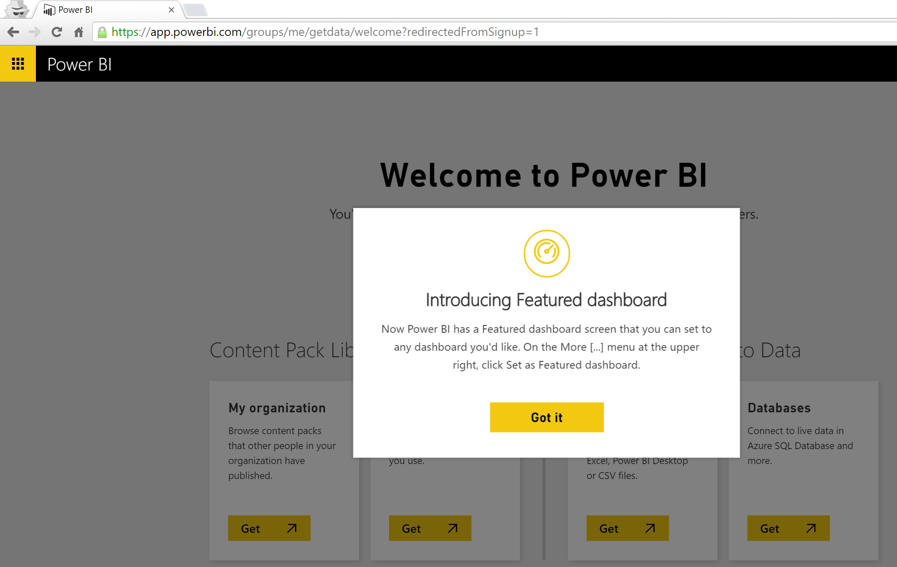

## (Documentation is not finished yet!)
# Sample Energia code connecting Microsoft Azure IoT Hub with a TI CC3200 Launchpad XL
Texas Instruments is one of the [Microsoft Azure Certified IoT partner] (https://azure.microsoft.com/en-us/marketplace/certified-iot-partners/) and TI CC3200 is listed in [Microsoft Azure IoT Developer Center](https://azure.microsoft.com/en-us/develop/iot/get-started/). Documentation in Azure IoT Developer Center includes an example for C code only. This document is prepared for TI CC3200 users who wants to connect to Azure IoT Hub using their  [Energia](http://www.energia.nu) IDE to start exploring the IoT world quickly.

### Requirements:
- TI CC3200 Launchpad XL
- A Microsoft Account (if you have any @hotmail.com, @live.com etc. email you already have one)
- Microsoft Azure Subscription (Azure free trial is OK as well)
- Following (http://www.ti.com/cc3200start) if you're just starting to write code for TI CC3200 Launchpad XL using Energia(http://www.energia.nu)

### Overview : 
In this document (and the code in the repo) you will 
 1. Connect your TI CC3200 to Azure IoT Hub
  1. Create an Azure free trial account
  2. Create an Azure IoT Hub
  3. Connect to your Azure IoT Hub using "Device Explorer" tool and create a "device"
  4. Program your CC3200 to connect your Azure IoT Hub
 2. See how to get your telemetry data out of [Azure Stream Analytics](https://azure.microsoft.com/en-us/services/stream-analytics/)
  1. Create an Azure Stream Analytics service and define the [input](https://azure.microsoft.com/en-us/documentation/articles/stream-analytics-define-inputs/) and [output](https://azure.microsoft.com/en-us/documentation/articles/stream-analytics-define-outputs/) to it
  2. Create an Azure Stream Analytics job and write your query retrieving your telemetry data from IoT Hub to [PowerBI](http://www.powerbi.com)
 3. See how to show your telemetry data in Microsoft PowerBI
  1. Create your free trial Microsoft PowerBI account
  2. See how to use the dataset created by your Azure Stream Analytics job and show your telemetry data in this dataset live in a PowerBI dashboard

### Step-by-step instructions:
 1. Connect your TI CC3200 to Azure IoT Hub
  1. Create an Azure free trial account
     Create a Microsoft Azure free trial account from [here](https://azure.microsoft.com/en-us/pricing/free-trial/) if you haven't used Microsoft Azure IoT Hub. 
  2. Create an Azure IoT Hub
      1. Go to [http://portal.azure.com](http://portal.azure.com) and login to the portal
      2. Click "New" as shown below : 
      
      3. Select "Internet of Things" and then "Azure IoT Hub" as shown below : 
      
      4. Give a "Name" to your IoT Hub being sure that you received check mark after typing your iot hub name, pick "Pricing and scale tier" as Free (you can have only one Free IoT Hub per each Azure subscription), keep "IoT Hub units" value as one and pick the lowes value for "Device-to-cloud partitions" as we will not put this system on production yet, give a name to your "Resource group", pick the right Azure Subscription in case if you have multiple Azure subscriptions, pick the "Location" and check the "Pin to dashboard" to be able to reach your Azure IoT Hub quickly through your portal dashboard.
      
      5. You will see that your IoT Hub started to be created : 
      
      6. When your IoT Hub created, click on its tile and you should see its details similar to the shown below : 
      
      7. Click on "Shared access policies", "iothubowner" to see the "Connection String"(s) 
      
      8. Just copy and note either of primary/secondary connection strings somewhere which will be using in coming steps
   3. Connect to your Azure IoT Hub using "Device Explorer" tool and create a "device" : 
      1. Go ahead and download free tool [Azure Device Explorer](https://github.com/Azure/azure-iot-sdks/blob/master/tools/DeviceExplorer/doc/how_to_use_device_explorer.md) and install
      2. Copy/Paste the connection string you noted down in step 1/ii/h into "IoT Hub Connection String" textarea under "Management" tab in Device Explorer and click "Update" button. You should get "connection succeeded"
      3. Switch to "Management" tab and click "Create" button to create a new "device" in your IoT hub.
      4. In the "" window give any name to your device (like "myCC3200-01"). You should get "" message when device is created in your IoT Hub
      5. Right-mouse click on your device in the "Devices" list and select "Copy connection string for selected device" from the context menu. Note this connection string down
 
 2.Program your CC3200 to connect your Azure IoT Hub
  1.Modifying necesary lines in "TICC3200_AzureIoTHub_Client.ino":
    1. Download all the files from this repo to a folder in your machine )
    2. Run your Energia and open "TICC3200_AzureIoTHub_Client.ino" sketch and put your WiFi name and password in the lines below

     ````Arduino
     // START: WiFi settings
     char SSID[] = "{YourWifiSSID}";
     char PASSWORD[] = "{YourWifiPassword}";
     // END: WiFi settings
     ````
    3. Copy/paste your device connection string you noted down in Step 1/iii/e and paste in the same "TICC3200_AzureIoTHub_Client.ino" sketch : 
    
     ````Arduino
     //Azure IoT Hub connection string
     String IoTHubConnectionString = "{PUT YOUR IOT HUB CONNECTION STRING HERE}";
     //String IoTHubConnectionString = "HostName=youriothubname.azure-devices.net;DeviceId=TIcc3200-a;SharedAccessKey=8A0K1er45k5l3achAmda7UvVh6s4L7HTBdt/RnAdYuk=";
     ````
 
    4. Save your sketch, compile and upload it to your TI CC3200 XL
    5. Using Energia's "Serial Monitor", verify that your TI CC3200 XL is connected to your IoT Hub and started sending telemetry data
    
 2. Get your telemetry data out of Azure Stream Analytics: 
  1. Create an Azure Stream Analytics service and define the "input" and "output"
   1. Go to [http://portal.azure.com](http://portal.azure.com) and login to the portal
   2. Click "New" and select "Internet of Things" and then "Stream Analytics job" as shown below : 
   3. 
  2. Create an Azure Stream Analytics job and write your query retrieving your telemetry data from IoT Hub to PowerBI
  3. 

 3. See how to show your telemetry data in Microsoft Power BI
  1. Create your free trial Microsoft Power BI account
   1. Go to [http://www.powerbi.com](http://www.powerbi.com) and click "Start for free" button : 
   
   2. We will use "Power BI" (not Power BI Desktop) : 
   
   3. Use your non-free mail to sign up (You can use .edu email as well)
   
   4. Check your email :
   

   
   5. Fill in the necessary details : 
   
   6. Power BI is going to create your account shortly : 
   
   7. Your Power BI account is ready : 
   
   8. Click "Get Data" to see from which data sources you can get data 
   
   
  2. See how to use the dataset created by your Azure Stream Analytics job and show your telemetry data in this dataset live in a PowerBI dashboard


