## (Documentation is not finished yet!)
# Sample Wiring code to use in Energia IDE for connecting Microsoft Azure IoT Hub with a TI CC3200 Launchpad XL
Texas Instruments is one of the [Microsoft Azure Certified IoT partner] (https://azure.microsoft.com/en-us/marketplace/certified-iot-partners/) and TI CC3200 is listed in [Microsoft Azure IoT Developer Center](https://azure.microsoft.com/en-us/develop/iot/get-started/). Documentation in Azure IoT Developer Center includes an example for C code only. This document is prepared for TI CC3200 users who wants to connect to Azure IoT Hub using their  [Energia](http://www.energia.nu) IDE to start exploring the IoT world quickly.

### Requirements:
- TI CC3200 Launchpad XL
- A Microsoft Account (if you have any @hotmail.com, @live.com etc. email you already have one)
- Microsoft Azure Subscription (Azure free trial is OK as well)
- Following (http://www.ti.com/cc3200start) if you're just starting to write code for TI CC3200 Launchpad XL using Energia(http://www.energia.nu)

### Overview : 
In this document (and the code in the repo) you will 
 1. Connect your TI CC3200 to Azure IoT Hub
  1. Create an Azure free trial account
  2. Create an Azure IoT Hub
  3. Connect to your Azure IoT Hub using "Device Explorer" tool and create a "device"
  4. Program your CC3200 to connect your Azure IoT Hub
 2. Create your [Microsoft Power BI](http://www.powerbi.com) account
 3. See how to get your telemetry data out of [Azure Stream Analytics](https://azure.microsoft.com/en-us/services/stream-analytics/) by creating an Azure Stream Analytics job, defining the [input](https://azure.microsoft.com/en-us/documentation/articles/stream-analytics-define-inputs/), [output](https://azure.microsoft.com/en-us/documentation/articles/stream-analytics-define-outputs/) and [query](https://azure.microsoft.com/en-us/documentation/articles/stream-analytics-stream-analytics-query-patterns/) and running it 
 4. Create your Power BI dashboard to show telemetry data in a realtime dashboard

### Step-by-step instructions:
 1. **Connect your TI CC3200 to Azure IoT Hub**
  1. Create an Azure free trial account
     Create a Microsoft Azure free trial account from [here](https://azure.microsoft.com/en-us/pricing/free-trial/) if you haven't used Microsoft Azure IoT Hub. 
  2. Create an Azure IoT Hub
      1. Go to [http://portal.azure.com](http://portal.azure.com) and login to the portal
      2. Click "New" as shown below : 
      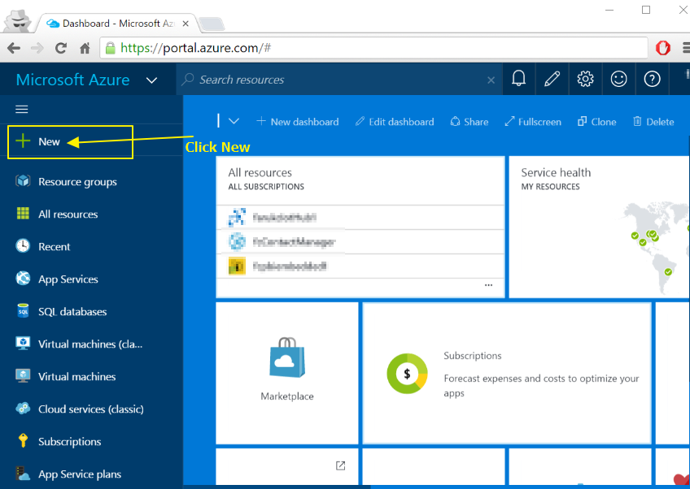
      3. Select "Internet of Things" and then "Azure IoT Hub" as shown below : 
      
      4. Give a "Name" to your IoT Hub being sure that you received check mark after typing your iot hub name, pick "Pricing and scale tier" as Free (you can have only one Free IoT Hub per each Azure subscription), keep "IoT Hub units" value as one and pick the lowes value for "Device-to-cloud partitions" as we will not put this system on production yet, give a name to your "Resource group", pick the right Azure Subscription in case if you have multiple Azure subscriptions, pick the "Location" and check the "Pin to dashboard" to be able to reach your Azure IoT Hub quickly through your portal dashboard.
      
      5. You will see that your IoT Hub started to be created : 
      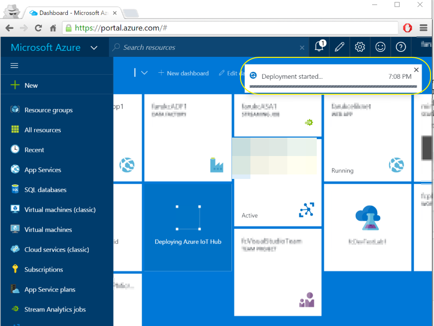
      6. When your IoT Hub created, click on its tile and you should see its details similar to the shown below : 
      
      7. Click on "Shared access policies", "iothubowner" to see the "Connection String"(s) 
      
      8. Just copy and note either of primary/secondary connection strings somewhere which will be using in coming steps
   3. Connect to your Azure IoT Hub using "Device Explorer" tool and create a "device" : 
      1. Go ahead and download free tool [Azure Device Explorer](https://github.com/Azure/azure-iot-sdks/blob/master/tools/DeviceExplorer/doc/how_to_use_device_explorer.md) and install
      2. Copy/Paste the connection string you noted down in step 1/ii/h into "IoT Hub Connection String" textarea under "Management" tab in Device Explorer and click "Update" button. You should get "Settings updated succesfully" message as shown below : 
      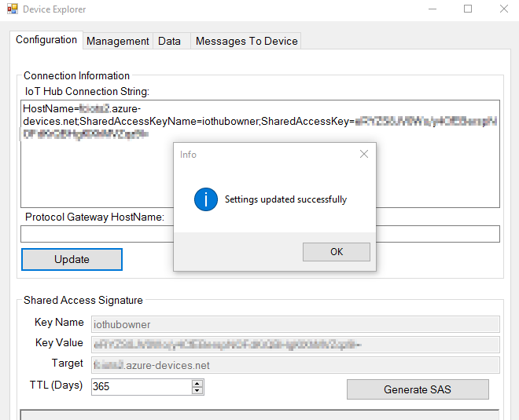
      3. Switch to "Management" tab and click "Create" button to create a new "device" in your IoT hub : 
      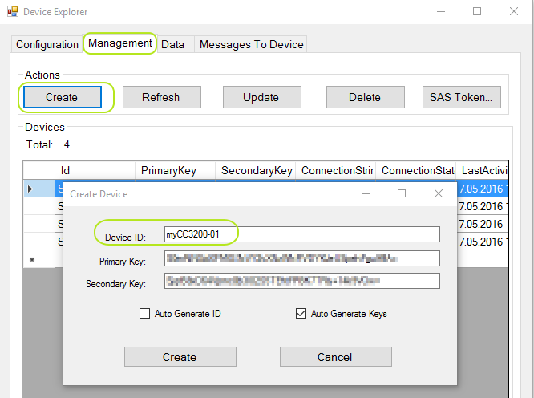
      4. In the "Create Device" window, give any name to your device (like "myCC3200-01"). You should see "Device created" dialog box as shown below : 
      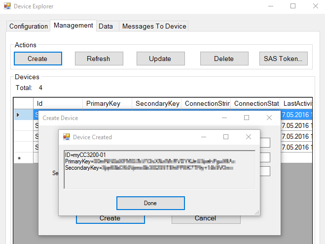
      <br>You will also see your device is added to your IoT hub: 
      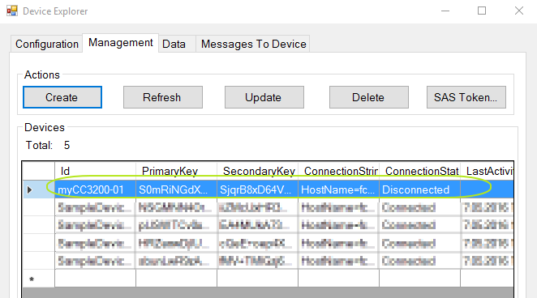
      5. Right-mouse click on your device in the "Devices" list and select "Copy connection string for selected device" from the context menu. Note this connection string down
      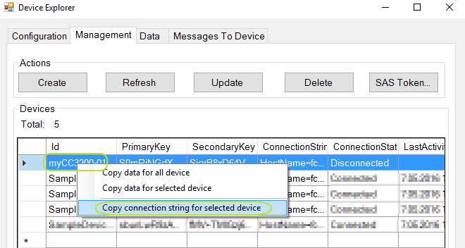
   4. Program your CC3200 to connect your Azure IoT Hub
     1. Download all the .ino, .cpp and .h files from this repo to a folder in your machine
     2. Run your Energia and open "TICC3200_AzureIoTHub_Client.ino" sketch and put your WiFi name and password in the lines below
       
       ````Arduino
       // START: WiFi settings
       char SSID[] = "{YourWifiSSID}";
       char PASSWORD[] = "{YourWifiPassword}";
       // END: WiFi settings
       ````
       
     3. Copy/paste your device connection string you noted down in Step 1/iii/e and paste in the same "TICC3200_AzureIoTHub_Client.ino" sketch : 
       
       ````Arduino
       //Azure IoT Hub connection string
       String IoTHubConnectionString = "{PUT YOUR IOT HUB CONNECTION STRING HERE}";
       //String IoTHubConnectionString = "HostName=youriothubname.azure-devices.net;DeviceId=TIcc3200-a;SharedAccessKey=8A0K1er45k5l3achAmda7UvVh6s4L7HTBdt/RnAdYuk=";
       ````
       
     4. Save your sketch, compile and upload it to your TI CC3200 XL
     5. Using Energia's "Serial Monitor", verify that your TI CC3200 XL is connected to your IoT Hub and started sending telemetry data

 2. **Create your free Microsoft Power BI account :**
   
     1. Go to [http://www.powerbi.com](http://www.powerbi.com) and click "Start for free" button : 
     
     
     2. We will use "Power BI" (not Power BI Desktop) : 
     
     
     3. Use your non-free mail to sign up (You can use .edu email as well)
     
     
     4. Check your email :
     
     
     
     5. Fill in the necessary details : 
     
     
     6. Power BI is going to create your account shortly : 
     
     
     7. Your Power BI account is ready : 
     
     
     8. Click "Get Data" to see from which data sources you can get data 
      
 

 3. **See how to get your telemetry data out of [Azure Stream Analytics](https://azure.microsoft.com/en-us/services/stream-analytics/) by creating an Azure Stream Analytics job, defining the [input](https://azure.microsoft.com/en-us/documentation/articles/stream-analytics-define-inputs/), [output](https://azure.microsoft.com/en-us/documentation/articles/stream-analytics-define-outputs/) and [query](https://azure.microsoft.com/en-us/documentation/articles/stream-analytics-stream-analytics-query-patterns/) and running it 
Get your telemetry data from IoT Hub using Azure Stream Analytics by creating an Azure Stream Analytics job, defining the "input", "output" and "query" and running it**
  1. Go to [http://portal.azure.com](http://portal.azure.com) and login to the portal
  2. Click "New" and select "Internet of Things" and then "Stream Analytics job" as shown below : 
  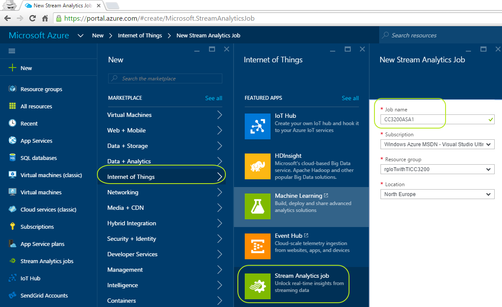
  3. Give any name to your job as shown above
  (Note that you should select the "Location" of your job same with your IoT Hub's location. In my example it's "North Europe")
  4. When your Stream Analytics job created, click on your Stream Analytics job and scroll down to see the "Job Topology" for inputs,query and outputs
  5. Click on "Inputs":
  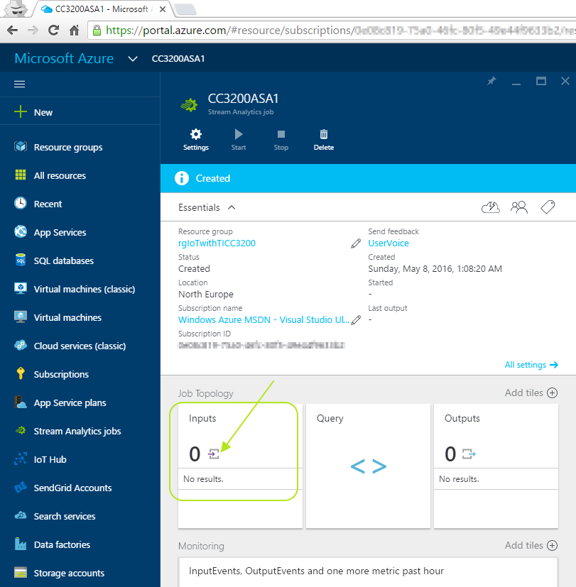
  6. Click on "Add" in the new blade :
  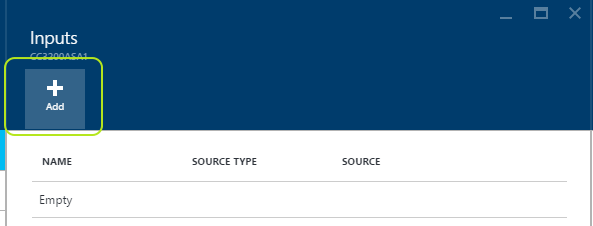
  7. Give a name for your "Input Alias" to use in your query later. Select the "Source" as "IoT hub" and select "Use IoT hub from current subscription" for "Subscription" and find your "IoT hub". Leave the rest as in default values : 
  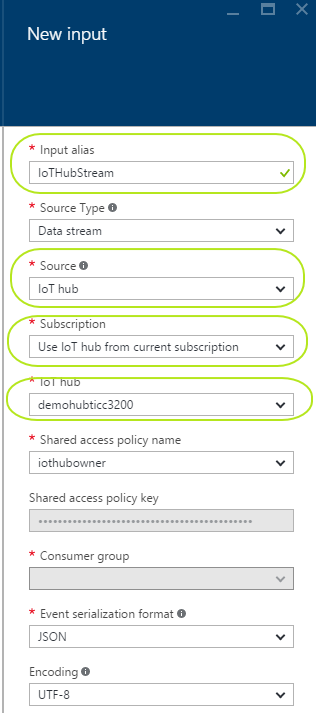
  8. It's time to define an "Output" for "Power BI". As of this document is prepared, creating an output for Power BI in http://portal.azure.com is not ready yet and we should switch to Azure Classic Portal [http://manage.windowsazure.com](http://manage.windowsazure.com) and login with our Azure credentials. Your services are listed on the left column in the classic portal. Find "Stream Analytics" and click to see your stream analytics jobs. Find your job you created in previous step and click to see its details as shown below : 
  
  9. Click on "Outputs" either from the top or click "3 Add an output" as shown below : 
  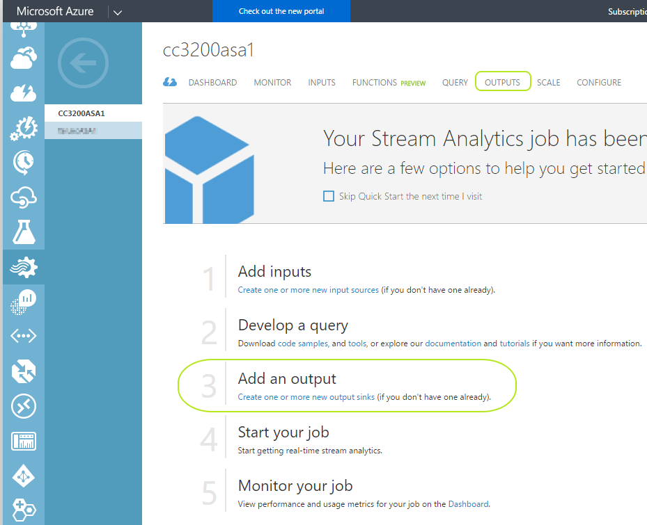
  10. Click "ADD AN OUTPUT" and select "Power BI" radio button : 
  
  
  11. Now you will "Authorize" your stream analytics job to reach your Power BI account. Click on "Authorize Now" as shown below : 
  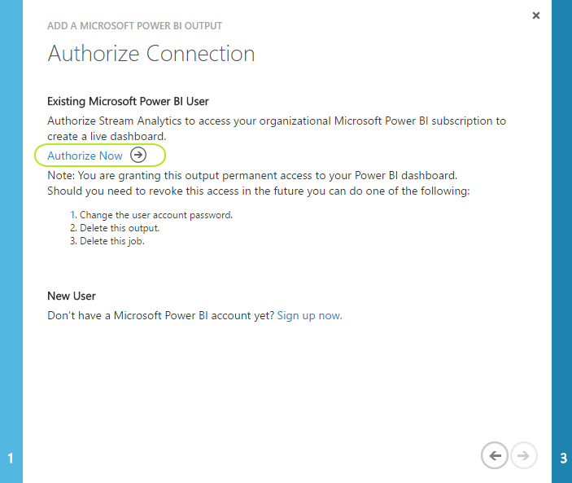
  12. Login to your Power BI account using your non-free email address : 
  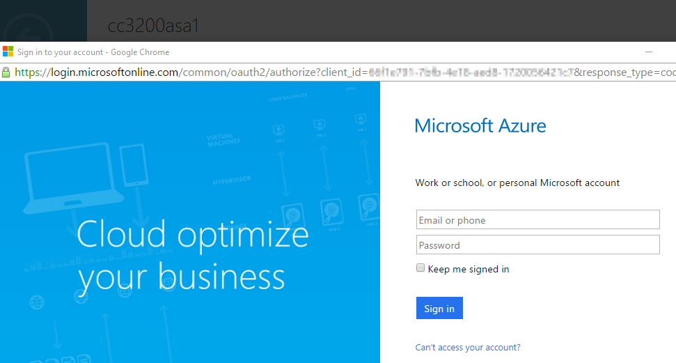
  13. Authorization is completed. Now you will define your "Output Alias" to use in your stream analtyics "Query". Give a name to your output alias, give a name for your "DataSet" which will be shown in your Power BI acount, give a name to your "Table" which will again be shown in your Power BI when you started using your "DataSet", leave "Workspace" as default and check mark at the bottom right : 
  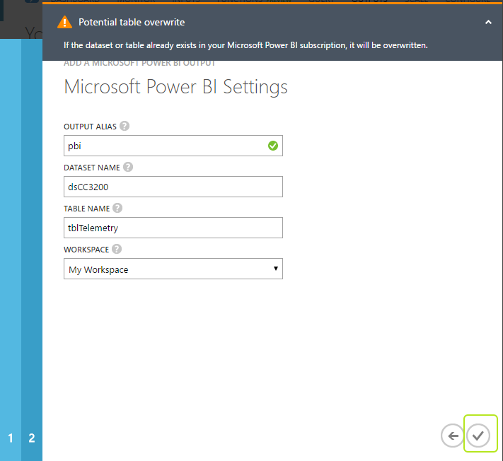
  14. In the classic portal, operational messages are shown at the bottom. You will see that it will create your "output" and also will test the connection : 
  
  15. After successfuly passing the connection for your output for Power BI, you can click "Dismiss Completed" to clear those operational messages : 
  
  16. You will see that your "output" for Power BI is "OK" : 
  
  17. Now click on "Query" to write your simple Stream Analytics job : 
  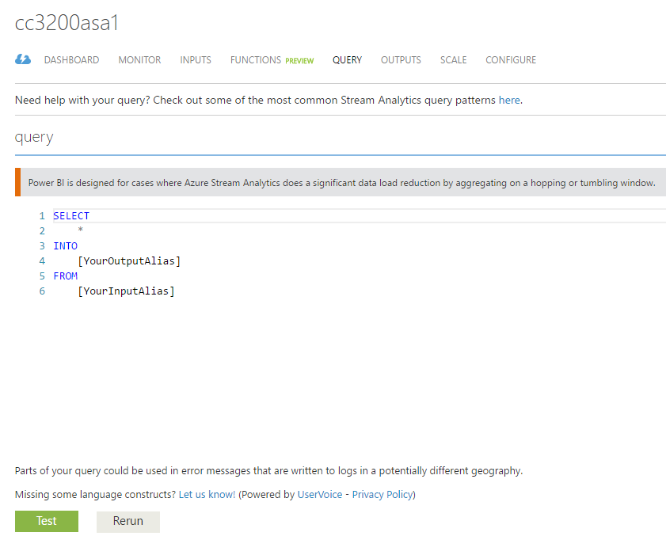
  18. As we are just trying to show the incoming telemetry in a realtime Power BI dashboard, we will not do a "filtering" in our query and it will be a simple "SELECT * INTO yourpowerbioutputalias FROM youriothubinputalias" query as shown below : 
  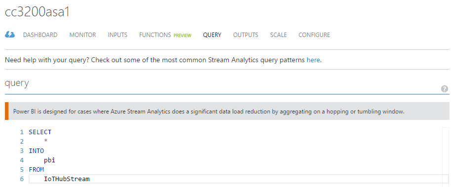
  19. After writing your query, you will see that stream analytics asks when the output should start. Leave the default option "Job Start Time" and click check mark at the bottom right and wait for job to start (which may take several minutes) : 
  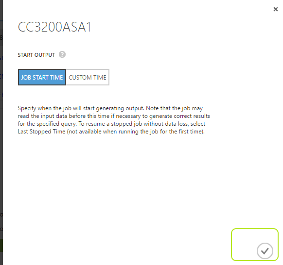
  
  
  20. 

 4. **Create your Power BI dashboard to show telemetry data in a realtime dashboard**
   1. Login to your Power BI account in [http://www.powerbi.com](http://www.powerbi.com) and click anywhere on the left right below 9 dot logo : 
   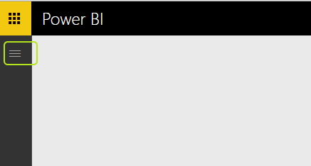
   2. Check your "Datasets" and you should see nothing or the "DataSet" name you set in step 3/xiii . If you see nothing be sure that your stream analytic job is running and you are not connected to your IoT Hub with "Device Explorer": 
   
   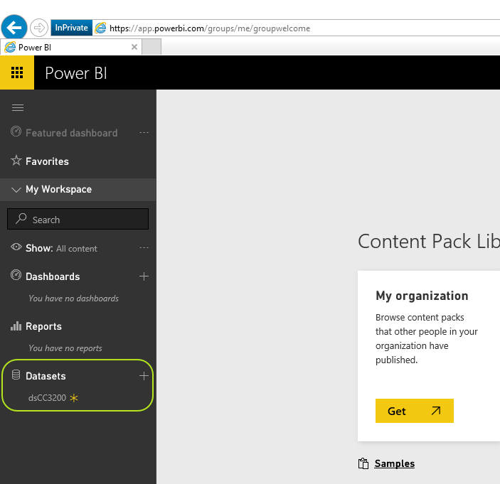
   3. Click on your dataset and you should see your table name you set in step 3/xiii. Expand your table to see your "fields".
   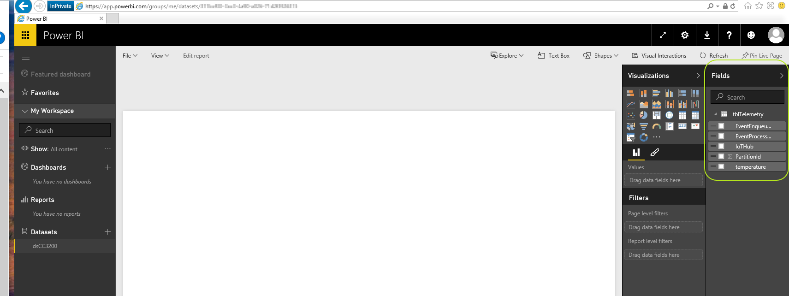
   4. Under "Visualisations" select line chart icon : 
   
   5. 


